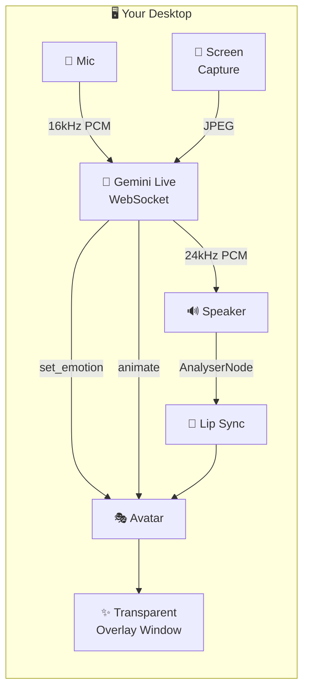

<div align="center">

# ✨ GemVTuber ✨

### Your AI Desktop Companion — Powered by Gemini Live

**A transparent, screen-aware VTuber that lives on your desktop.**<br>
**Not face-tracked. AI-driven. Emotionally expressive. Sub-second voice.**

[](https://opensource.org/licenses/MIT)
[](CONTRIBUTING.md)
[](https://electronjs.org)
[](https://ai.google.dev/gemini-api/docs/live)

---

**⚡ Sub-second voice** · **👁 Screen-aware** · **🎭 Any VTuber model** · **💫 AI-composed animations** · **🖥 Transparent overlay**

</div>

---

## 🎯 What is GemVTuber?

GemVTuber is a desktop companion that sits on your screen as a transparent VTuber avatar — powered entirely by **Gemini's native audio AI**. Unlike traditional VTubers controlled by face tracking, this avatar is **driven by the AI itself**: it decides its own expressions, animations, and reactions.

Talk to it. It sees your screen. It remembers you. It gets mad if you game too long. 😤

### Key Features

- 🗣️ **Real-time voice conversation** — Sub-second response via Gemini Live native audio (not the slow ASR→LLM→TTS pipeline)
- 👁️ **Screen awareness** — Periodically captures your screen and builds contextual awareness ("You've been gaming for 2 hours...")
- 🎭 **Any Live2D model** — Drop in any VTuber model. The AI auto-discovers all parameters, expressions, and motions
- 💃 **AI-composed animations** — Ask it to jump, wiggle, or dance. Gemini composes animations from available body parameters on the fly
- 🎨 **5 personalities** — Caring, Playful, Sarcastic, Strict, or Chill. Or write your own
- 👄 **Smart lip sync** — Volume + frequency analysis for natural-looking mouth movement
- 😊 **Reliable expressions** — Function calling (not text parsing) for consistent emotion triggers
- 🖥️ **True transparency** — No background, sits over everything, click-through on empty areas
- 🧠 **Remembers you** — Stores observations and preferences across sessions
- ⚙️ **Single app** — No Python backend, no complex setup. Just one Electron app

---

## 🏆 How We Compare

| Feature | GemVTuber | Open-LLM-VTuber |
|:---|:---:|:---:|
| **Voice latency** | ⚡ Sub-second (native audio) | 🐌 2-5s (ASR→LLM→TTS cascade) |
| **Voice quality** | 🎵 Emotionally expressive | 🤖 Separate TTS engine |
| **Lip sync** | 👄 Volume + frequency shapes | 👄 Volume only (open/close) |
| **Expression trigger** | ✅ Function calling (reliable) | ⚠️ Text tag parsing (unreliable) |
| **Emotion detection** | ✅ Detects user mood from voice | ❌ None |
| **Architecture** | 📦 Single Electron app | 🔧 Python + Electron (two processes) |
| **Setup** | 🎯 Paste API key, go | 📋 Python + Node + YAML config |
| **Model flexibility** | 🔍 Auto-discovers parameters | ✏️ Manual config per model |
| **Custom animations** | 💫 AI composes them on-the-fly | ❌ Pre-made only |

---

## 🚀 Quick Start

### Prerequisites
- [Node.js](https://nodejs.org/) 18+
- A [Google AI API key](https://aistudio.google.com/apikey) (free tier works!)

### 3 Steps

```bash
# 1. Clone
git clone https://github.com/user/gem-vtuber.git
cd gem-vtuber

# 2. Install
npm install

# 3. Run
npm start
```

A cute default avatar appears on your desktop. Right-click → Settings → paste your API key → start talking! 🎤

---

## ⌨️ Hotkeys

GemVTuber supports global hotkeys so you can talk even while gaming or working in other apps:

- **`Ctrl + \`` (Hold):** Push-to-Talk. Unmutes the mic while held, mutes when released.
- **`Ctrl + Space`:** Toggle Mic. Permanently turns the mic on or off.

*(Note: Use `Cmd` instead of `Ctrl` on macOS)*

---

## 🎭 Bring Your Own Model

GemVTuber works with **any Live2D model** out of the box:

1. Get a model from [Booth.pm](https://booth.pm/), [nizima](https://nizima.com/), or create one with [Live2D Cubism Editor](https://www.live2d.com/en/cubism/)
2. Right-click avatar → Settings → **Load Model** → select the `.model3.json` file
3. Done! GemVTuber auto-discovers all parameters, expressions, and motions

The AI automatically adapts to your model's capabilities. If your model has a "happy" expression, Gemini will use it. If it has body parameters, Gemini can animate them.

> **Note:** Live2D models require the Cubism Core SDK at runtime. GemVTuber loads it automatically from CDN. See [CONTRIBUTING.md](CONTRIBUTING.md) for details.

---

## 💃 Custom Animations

### AI-Composed (Automatic)

Just ask! "Do a little jump!" or "Wiggle for me!" — Gemini will compose an animation from your model's available parameters.

### User-Defined (custom-actions.json)

Create a `custom-actions.json` in your model's folder for repeatable animations:

```json
{
  "jump": {
    "duration_ms": 500,
    "easing": "ease-out-bounce",
    "keyframes": [
      { "t": 0, "params": { "ParamBodyAngleY": 0 } },
      { "t": 0.4, "params": { "ParamBodyAngleY": 15 } },
      { "t": 1.0, "params": { "ParamBodyAngleY": 0 } }
    ]
  },
  "wiggle": {
    "duration_ms": 300,
    "repeat": 3,
    "easing": "ease-in-out",
    "keyframes": [
      { "t": 0, "params": { "ParamAngleZ": -5 } },
      { "t": 0.5, "params": { "ParamAngleZ": 5 } },
      { "t": 1.0, "params": { "ParamAngleZ": -5 } }
    ]
  }
}
```

GemVTuber auto-discovers these and makes them available to Gemini as callable tools.

**Animation priority:** Model built-in motion → Custom action → AI-composed animation

---

## 🧠 How It Works



1. **Mic audio** streams to Gemini Live API via WebSocket (16kHz PCM)
2. **Gemini responds** with native audio (24kHz) — not text-to-speech, actual voice
3. **Audio output** drives lip sync via FFT frequency analysis
4. **Function calls** trigger expressions and animations on the avatar
5. **Screen captures** at random intervals build contextual awareness
6. Everything renders on a **transparent, always-on-top** Electron window

---

## 🎨 Personalities

| Personality | Description |
|:---|:---|
| 💖 **Caring** | Warm, supportive best friend. Worries about you. |
| 🎮 **Playful** | Energetic, loves jokes, makes everything fun. |
| 😏 **Sarcastic** | Sharp wit, dry humor, roasts you lovingly. |
| 📚 **Strict** | No-nonsense mentor. Keeps you accountable. |
| 😎 **Chill** | Laid-back, goes with the flow, calming presence. |
| ✏️ **Custom** | Write your own personality prompt. |

---

## 🗺️ Roadmap

- [x] Core voice conversation with Gemini Live
- [x] Transparent desktop overlay
- [x] Live2D model loading & auto-discovery
- [x] Volume + frequency lip sync
- [x] Function-calling expressions
- [x] AI-composed procedural animations
- [x] Screen capture & contextual awareness
- [x] Personality system with memory
- [ ] VRM (3D model) support
- [x] Push-to-talk hotkey
- [ ] Multi-monitor support
- [ ] OBS capture source for streaming
- [ ] Plugin system for custom tools
- [ ] Group chat mode (multiple avatars)

---

## 🤝 Contributing

We'd love your help! See [CONTRIBUTING.md](CONTRIBUTING.md) for guidelines.

**Areas where help is especially wanted:**
- 🎨 Default avatar designs
- 🌐 VRM model support
- 🎮 Game detection & integration
- 📝 Documentation & tutorials
- 🧪 Testing on different systems

---

## 📄 License

MIT — see [LICENSE](LICENSE) for details.

GemVTuber does **not** bundle the Live2D Cubism SDK. Users are responsible for their own compliance with [Live2D's licensing](https://www.live2d.com/en/sdk/license/) when using Live2D models.

---

<div align="center">

**If GemVTuber made you smile, give it a ⭐!**

Made with 💜 and Gemini

</div>
